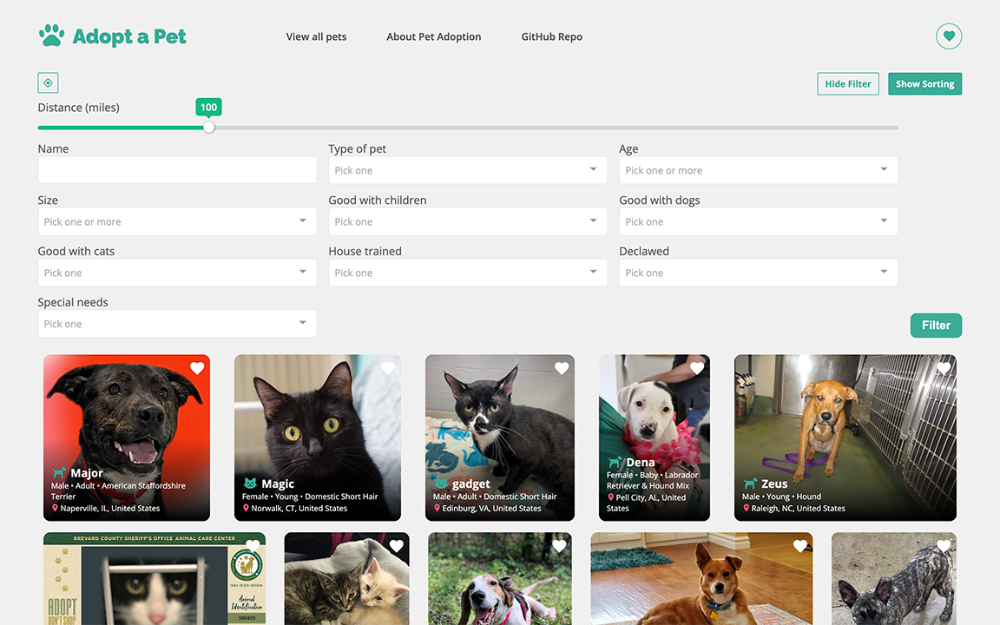

# Adopt A Pet

A [Vue.js](https://vuejs.org/) app for pet adoption, with pet data fetched from the [Petfinder API](https://www.petfinder.com/). Visitors can view and save pets, search with keywords and/or filters.

## Table of Content

- [Final Product](#final-product)
- [Dependencies](#dependencies)
- [Getting Started](#getting-started)
- [Credits](#credits)

## Live Demo

The server is deployed to [Heroku](https://heroku.com/). [Netlify](https://www.netlify.com/) serves the static client assets:

https://the-pets.netlify.app/

It might take some time to load up the server.

## Final Product

### Landing Page

User can:

- View all pets by clicking `Start Looking` / `View all pets` in the nav bar
- View liked pets by click the heart button at the top right corner

### `View All Pets` Page

User can:

- Click on any pet cards to view the details of the pet (opens in a new window).

- Like/unlike any pets by clicking the heart icon on the top right corner of the pet cards. The color of the heart icon indicates if the user has liked the pet.

- Show/hide filter and sorting by clicking the buttons at the top right corner. Only one (of sorting, filter) is shown at a time.

- Enable/disable location by clicking the gps icon at the top left corner. The filter/sort with distance function only works when the location is enabled.

Filters with enabled location: user can filter with distance from current location

Filters with disabled location

Sorting with enabled location: user can sort result with distance from current location

Sorting with disabled location

### Pet Details Page

User can:

- View all the media on the left

- View details on the right, including a link to the pet profile on [Petfinder](https://www.petfinder.com/)

- Like/unlike the pet by clicking the heart icon on the top right corner of the pet cards. The color of the heart icon indicates if the user has liked the pet.

### Liked Pet Page

User can:

- View all the pets that the users has liked. Status of the pet is shown on the card if the pet is no longer adopable.

- Click on any pet cards to view the details of the pet (opens in a new window).

- Like/unlike any pets by clicking the heart icon on the top right corner of the pet cards. The color of the heart icon indicates if the user has liked the pet.

## Dependencies

### Frontend

- [Vue.js](vuejs.org/)
- [Axios](https://axios-http.com/)
- [Vue 3 Slider](https://github.com/vueform/slider): slider for varying distance in filter
- [Vue-Multiselect](https://vue-multiselect.js.org/): filters
- [Vue Material Design Icon Components](https://github.com/robcresswell/vue-material-design-icons)

### Backend

- [Express](https://expressjs.com/)
- [cookie-session](https://github.com/expressjs/cookie-session)
- [pg](https://www.npmjs.com/package/pg)
- [nodemon](https://nodemon.io/): reload the server when there is a change in the file during development

## Getting Started

1. Clone or download this repository onto your local device.
2. `cd` to the folder where this project is cloned.
3. Install all dependencies with `npm install` command.
4. Create a `.env.local` file by copying the contents from `.env`:

- Set up your [PostgreSQL](https://www.postgresql.org/) database for this project and fill in the values for `DB_HOST`, `DB_USER`, `DB_PASS` and `DB_NAME`
- Get API key from [Petfinder API](https://www.petfinder.com/developers/) and fill in the values for `VUE_APP_ID` and `VUE_APP_SECRET`
- Fill in the `SECRET` value for the cookie sessions

5. Create tables in the database with the files in `server/db/schema`.
6. Run the server with `npm start` command.
7. Run the app in the development mode with `npm run serve` command.
8. Open the broswer and visit: [http://localhost:3001/](http://localhost:3001/).

## Credits

- [Petfinder API](https://www.petfinder.com/developers/)

- [Design](https://www.behance.net/gallery/134895919/Puppos-Dog-Adoption-Matchmaker-Design-Sprint-Case-Study) by [Christy Chan](https://www.behance.net/christykchan) on [behance](behance.net/)

- [Favicon](https://www.flaticon.com/premium-icon/paws_4225935) by [Creatype](https://www.flaticon.com/authors/creatype) on [flaticon](https://www.flaticon.com/)

- [Background image on home page](https://unsplash.com/photos/O_UbPKaz6no) by [Slavy Darozhkin](https://unsplash.com/@hashtaglilac) on [Unsplash](https://unsplash.com)
